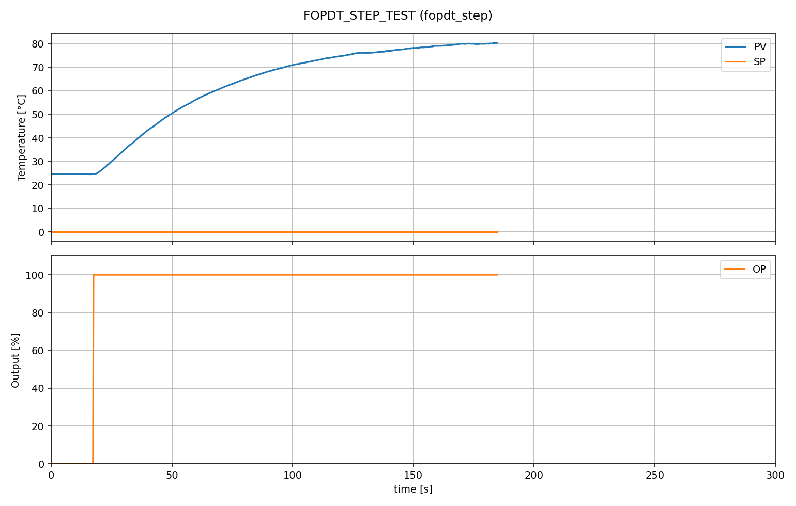
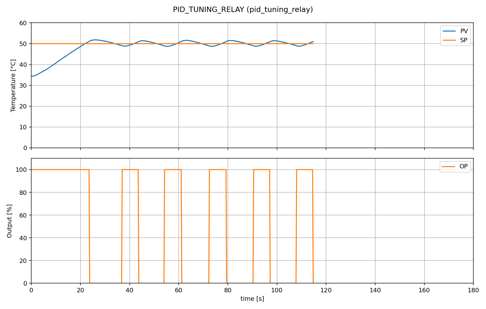
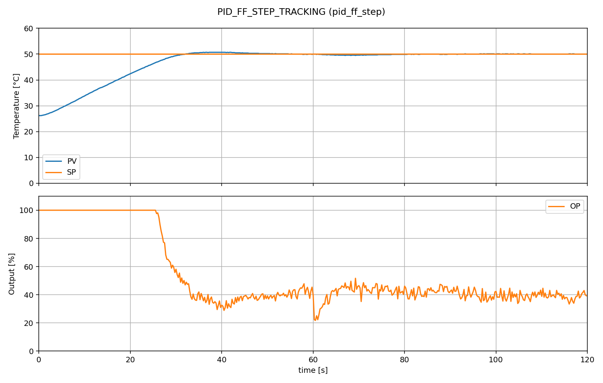
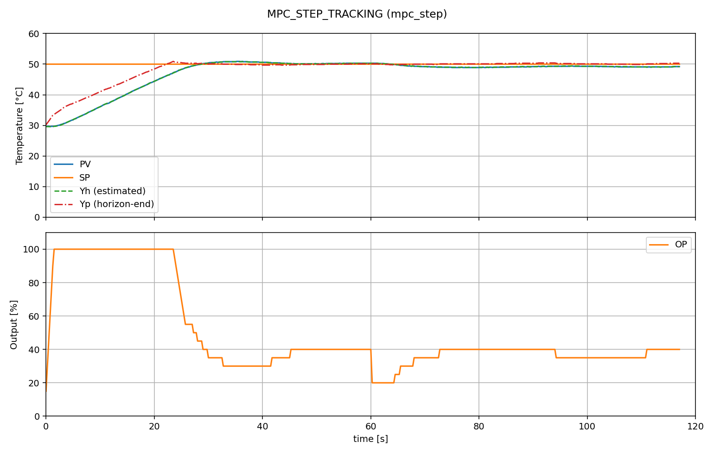

# PicoPID Lab (MicroPython, RP2040)

Current version: **v1.2.10** (2026-03-16)

PicoPID Lab is an open-source educational platform for university control-systems courses.  
Students experiment with ON/OFF, PID, Fuzzy, and MPC algorithms on real hardware (RP2040-based thermal plant), then compare controller performance through telemetry, metrics, and plots.

Primary runtime is **MicroPython on RP2040** (RP2040-Zero class boards).


## What This Shows

The platform is built around one simple lab workflow:
- identify the thermal plant
- tune a controller
- run closed-loop experiments
- compare plots and metrics

Core observed variables:
- `PV` measured temperature [°C]
- `SP` setpoint temperature [°C]
- `OP` heater output [%]
- `YH` model estimate [°C] in MPC mode
- `YP` model prediction [°C] in MPC mode

Typical plot meaning:
- `PV` vs `SP` shows how well the controller tracks the target temperature
- `OP` shows how aggressively the heater is driven
- FOPDT identification plots show the open-loop thermal step used to estimate `K`, `tau`, and `theta`
- tuning and standard runs produce metrics and comparison plots for repeatable lab reports

## Example Results

### FOPDT identification



Open-loop heater step used to estimate the thermal model parameters `K`, `tau`, and `theta`.

### PID relay tuning



Relay cycling around the target temperature for extracting oscillation metrics and tuned gains.

### PID feedforward tracking



Closed-loop tracking with feedforward support and a disturbance event, showing `PV` recovery to `SP` and the corresponding heater effort.

### MPC tracking



Predictive control example with `YH` and `YP`, including a disturbance event to show model-based recovery and constrained output moves.

Students primarily edit one file:
- `firmware/config.py`

## Project Layout

- `firmware/` firmware modules on device
- `runner/lab.py` host lab terminal + experiment runner
- `runner/lab.yaml` host experiment/config source of truth

Documentation language folders:
- `docs/en/` (English)
- `docs/bg/` (Bulgarian)
- `docs/de/` (German)
- `docs/es/` (Spanish)
- `docs/uk/` (Ukrainian)
- `docs/it/` (Italian)
- `docs/fr/` (French)

## Quick Start

1. Flash MicroPython to RP2040 (once).
2. Upload files from `firmware/` to board root.
3. Install host dependencies:
   - `pip install pyserial pyyaml matplotlib numpy`
4. Edit experiments in `runner/lab.yaml`.
5. Start host interface:
   - `python3 runner/lab.py`

After connect, the runner enters `lab>` directly.

## Host Terminal Commands (`lab>`)

- `h` help
- `c` catalog
- `e <id|exp_id>` run experiment
- `s` stop active firmware run
- `k` firmware `check`
- `u` host status
- `x` reconnect serial
- `b` terminal home/refresh
- `q` quit

Notes:
- Host uses `LAB:` messages.
- Firmware keeps `# ...` messages/tokens.
- In terminal mode, text telemetry is hidden; live plot and live metrics are always on.
- During active long runs (`control`, `tune`, `model`, `monitor`), one-letter host commands are intercepted locally; `s` maps to firmware `stop`.

## Firmware Terminal Commands (device side)

At firmware prompt (`lab>`), typical commands:
- `status`
- `params`, `params <group>`, `params all`
- `check`
- `pid`
- `<PARAM> <VALUE>` or `<PARAM>=<VALUE>`
- `control`, `tune`, `model`, `monitor`
- during active run: `stop`, `restart`, `help`

## Supported Control Modes

Set in `firmware/config.py`:

- `CONTROL_MODE = "ONOFF"`
- `CONTROL_MODE = "PID"`
- `CONTROL_MODE = "FUZZY"`
- `CONTROL_MODE = "MPC"`

For PID family:
- `PID_VARIANT`: `PID`, `2DOF`, `FF_PID`, `GAIN_SCHED`, `SMITH_PI`
- `PID_ALGORITHM`: `PARALLEL`, `IDEAL`, `SERIES`
- `TUNING_METHOD`:
  - model-based: `ZN1_P`, `ZN1_PI`, `ZN1_PID`, `CC_P`, `CC_PI`, `CC_PID`
  - relay-based: `ZN2_P`, `ZN2_PI`, `ZN2_PID`, `TL_P`, `TL_PI`, `TL_PID`

## Two Workflows

### A) Thonny-only workflow

- Run `firmware/main.py` from Thonny.
- Use firmware commands directly in Thonny shell.
- Best for interactive teaching/demo sessions.

### B) Host lab workflow (`runner/lab.py`)

- Experiment-driven runs from `runner/lab.yaml`
- Automatic run folders with telemetry CSV/log/metrics
- Best for report-grade repeatable experiments

Run artifacts:
- `runner/runs/<timestamp>__<EXPERIMENT>__<shortname>/`

## Experiment Kinds (`runner/lab.yaml`)

- `standard` fixed-duration tracking run
- `fopdt` open-loop model identification
- `tuning` tuning procedure
- `sweep` cartesian parameter sweep

Completion token in firmware:
- `# FINISH: done`

## Telemetry

Firmware modes (`TELEMETRY_MODE`):
- `INFO` status/report lines only
- `NORMAL` `PV/SP/OP`
- `MPC` `PV/SP/OP` + `YH/YP` in MPC mode

Canonical runtime line:
```text
PV:25.3 SP:30.0 OP:45.0
```

MPC extended line:
```text
PV:25.3 SP:30.0 OP:45.0 YH:25.1 YP:26.4
```

## Safety

Configured in `firmware/config.py`:
- `TEMP_CUTOFF_C`

At cutoff:
- heater forced OFF
- active run aborted immediately

## Reporting Style

- `docs/en/REPORTING_STYLE.md`

## Community

- Code of Conduct: `codeofconduct.md`
- Contributing guide: `CONTRIBUTING.md`
